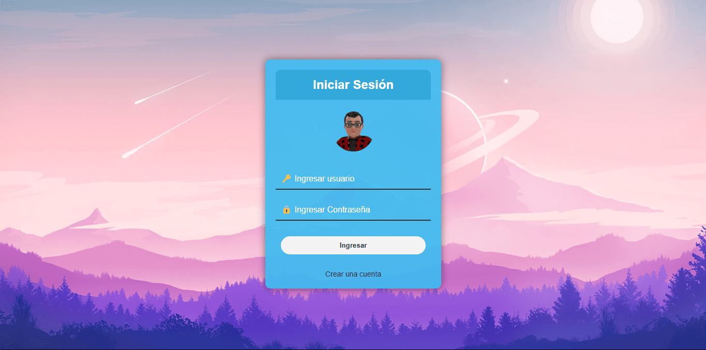

# Portal de Inicio de Sesión

Esta práctica se enfoca en la implementación de un sistema de gestión de acceso de usuarios utilizando PHP y MySQL. El sistema consta de tres partes principales: el formulario de inicio de sesión, la página de registro de nuevos usuarios y la página de listado de usuarios una vez autenticados.

<p align="center">
  
</p>

El formulario de inicio de sesión presenta campos para que los usuarios ingresen su nombre de usuario y contraseña. Utiliza estilos CSS para personalizar la apariencia y ofrece una experiencia de usuario intuitiva. Si el usuario no tiene una cuenta, puede acceder a la página de registro a través del enlace proporcionado.

La página de registro permite a los usuarios crear nuevas cuentas. Al igual que el formulario de inicio de sesión, solicita un nombre de usuario y una contraseña. Una vez completado el registro, los datos se envían a la base de datos MySQL para su almacenamiento seguro.

Una vez autenticados, los usuarios son redirigidos a la página de listado de usuarios. Esta página muestra una tabla con los usuarios registrados, incluidos sus nombres de usuario y contraseñas. Además, ofrece la funcionalidad de cerrar sesión para finalizar la sesión del usuario activo.

La práctica utiliza tecnologías web estándar como HTML, CSS, PHP y MySQL para el desarrollo del sistema de autenticación y gestión de usuarios. El uso de PHP permite la interacción con la base de datos MySQL para realizar operaciones de registro, inicio de sesión y recuperación de datos de usuario.

La implementación de este sistema de gestión de acceso de usuarios proporciona una forma segura y eficiente de administrar las credenciales de los usuarios. Al utilizar tecnologías web ampliamente utilizadas como PHP y MySQL, se garantiza una compatibilidad sólida y un rendimiento confiable. Esta práctica es una adición valiosa a cualquier portafolio web, demostrando habilidades en el desarrollo de aplicaciones web seguras y funcionales.

**Consulta la versión preliminar de la practica aquí:** [https://practica_10.com](https://alejandrovillegas.net/projects/practice-10/index.php)

# 📌 Información de la Practica

Esta practica ha sido desarrollado como parte del portafolio de soluciones tecnológicas, con el objetivo de ofrecer una herramienta eficiente y funcional para usuarios autodidactas interesados en la gestión y desarrollo de proyectos web.

- **Área**: Desarrollo de Practicas Web

- **Usuario Final**: TecNM

- **Fecha de Desarrollo**: 25 de octubre de 2018

- **Portafolio de Proyectos**: [www.alejandrovillegas.net](https://www.alejandrovillegas.net/)

# Guía de Instalación y Configuración

## 🖥️ Requisitos del Sistema

Para ejecutar esta practica de manera local, es necesario contar con un entorno de desarrollo que incluya Apache, MySQL y PHP. Se recomienda el uso de **XAMPP**, ya que fue el entorno con el que se desarrolló la practica. Sin embargo, también es compatible con:

- **XAMPP** (Windows, macOS, Linux)

- **WAMP** (Windows)

- **MAMP** (macOS, Windows)

- **LAMP** (Linux)

## 🔧 Instalación y Configuración de la Practica

Siga los pasos según el entorno de desarrollo que esté utilizando:

### Para XAMPP (Recomendado)

1. Descargue y descomprima el archivo de la practica en su sistema local.

2. Copie la carpeta de la practica y colóquela en el directorio **_htdocs_** dentro de la carpeta de instalación de XAMPP (Ejemplo: **C:\xampp\htdocs\mi_practica**).

### Para WAMP

1. Descargue y descomprima el archivo de la practica.

2. Copie la carpeta de la practica y colóquela en el directorio **_www_** dentro de la carpeta de instalación de WAMP (Ejemplo: **C:\wamp64\www\mi_practica**).

### Para MAMP

1. Descargue y descomprima el archivo de la practica.

2. Copie la carpeta de la practica y colóquela en el directorio **_htdocs_** dentro de la carpeta de instalación de MAMP (Ejemplo: **/Applications/MAMP/htdocs/mi_practica**).

### Para LAMP

1. Descargue y descomprima el archivo de la practica.

2. Mueva la carpeta de la practica a **_/var/www/html/_** utilizando el siguiente comando en la terminal:

```
sudo mv mi_practica /var/www/html/
```

## 🗄️ Configuración de la Base de Datos

### Para XAMPP, WAMP y MAMP

1. Inicie su entorno de desarrollo y asegúrese de que **Apache** y **MySQL** estén en ejecución.

2. Abra su navegador y acceda a **_phpMyAdmin_** ingresando:

- **XAMPP**: http://localhost/phpmyadmin

- **WAMP**: http://localhost/phpmyadmin

- **MAMP**: http://localhost:8888/phpmyadmin

3. Diríjase a la pestaña **SQL** e ingrese el siguiente código para crear la base de datos:

```
CREATE DATABASE General;
```

4. Vaya a la pestaña Importar y seleccione el archivo **_DataBase.sql_** del repositorio para importar la estructura y los datos.

### Para LAMP

1. Abra la terminal y acceda a MySQL con:

```
mysql -u root -p
```

2. Cree la base de datos ejecutando:

```
CREATE DATABASE General;
```

3. Salga de MySQL y luego importe la base de datos con:

```
mysql -u root -p General < /ruta/del/archivo/DataBase.sql
```

Reemplace **_/ruta/del/archivo/_** con la ubicación real del archivo en su sistema.

## 🚀 Ejecución de la Practica

1. Inicie su entorno de desarrollo:

- **XAMPP**: Abra el "Panel de Control de XAMPP" y active **Apache** y **MySQL**.

- **WAMP**: Haga clic en el icono de WAMP y active los servicios.

- **MAMP**: Abra MAMP y haga clic en **Start Servers**.

- **LAMP**: Ejecute los siguientes comandos en la terminal:

```
sudo systemctl start apache2
sudo systemctl start mysql
```

2. Abra un navegador e ingrese la siguiente URL según el entorno:

- **XAMPP / WAMP**: **_http://localhost/_**

- **MAMP**: **_http://localhost:8888/_**

- **LAMP**: **_http://localhost/_**

La practica ahora está funcionando en su entorno local. 🎉

## 🔑 Credenciales de Acceso

### 👤 Detalles de Inicio de Sesión para Usuario Preregistrado

- Nombre de usuario: **_Usuario-Inventado01_**

- Contraseña: **_12345_**

Tambien puede **registrar un nuevo usuario** desde la interfaz de la aplicación.
